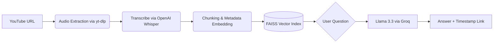

# 📹 TubeMind: The Video Knowledge Engine

> **"Don't watch the whole video. Just ask what you need."**

TubeMind is a **Multimodal RAG (Retrieval-Augmented Generation)** application that allows users to "chat" with YouTube videos. It processes video content into text, indexes it using semantic search, and uses the **Llama 3.3** LLM to provide accurate answers with **timestamped citations**.

---

## 🚀 How It Works (The Architecture)

TubeMind allows you to bypass the "TL;DW" (Too Long; Didn't Watch) problem by treating video as a queryable database.

##  Tech Stack
* LLM Engine:** Llama 3.3 (70B) via Groq Cloud (Ultra-low latency)
* Transcription:** OpenAI Whisper (Local efficient base model)
* Vector Database:** FAISS (Facebook AI Similarity Search) - *Chosen for zero-dependency local performance.*
* Orchestration:** LangChain (Chains & Retrievers)
* Frontend:** Streamlit

##  Key Features
* Sub-Second Retrieval:** Uses FAISS in-memory indexing to find relevant video segments instantly.
* Timestamp Linking:** Every answer includes a clickable "jump-to" link (e.g., `[04:12]`) that takes you to the exact moment in the video.
* Intelligent Chunking:** Groups transcripts into context-aware blocks to prevent "context fragmentation" hallucinations.
* Cloud Native:** Deployed on Streamlit Community Cloud with auto-installing dependencies (`ffmpeg`).
